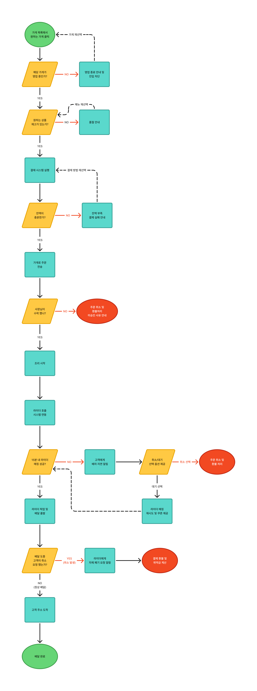

# 배달 서비스 시스템 플로우 차트 분석

## 1. 시스템 플로우 차트

## 2. 프로세스 분석
1.배달 앱 통해 원하는 가게 진입합니다

2.원하는 메뉴를 장바구니에 담고 '주문하기'를 클릭합니다

3.시스템이 현재 영업 상태와 메뉴 재고를 실시간으로 체크합니다

4.결제 시스템을 호출하여 승인 처리를 완료합니다

5.가게로 주문 정보를 전송하고 사장님이 수락합니다

6.조리와 동시에 인근 라이더에게 배차를 요청하고 매칭합니다

7.배달이 완료 되었습니다

## 3. 예외 상황 발굴 및 대응

영업 종료 >> 다른 가게 선택을 유도합니다

메뉴 품절 >> 다른 제품 선택을 유도합니다

결제 실패 >> 다른 결제 방법을 유도합니다

사장님이 주문 거절 >> 주문 취소 및 환불 처리와 함께 미승인 사유를 안내합니다

라이더 매칭 실패 >> 고객에게 지연을 알림으로 보낸 뒤 취소/대기 옵션을 제공합니다

배달 중 고객 변심 >> 라이더에게 자체 폐기를 요청하고 환불 및 위약금을 계산합니다

서버 및 네트워크 오류 >> 시스템 내부에서 여러번 재시도하고 오류시 시스템 점검중과 함께 알람

